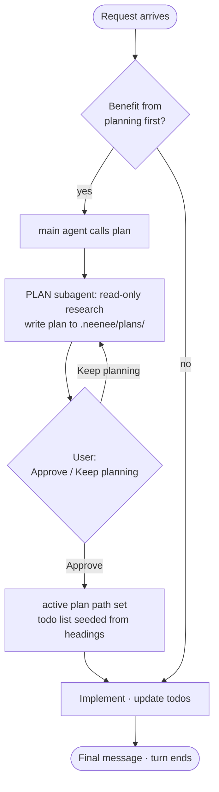
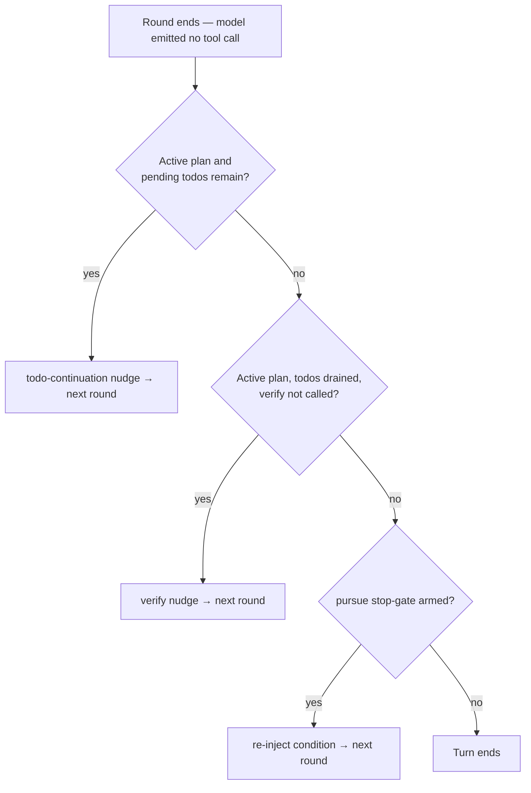

# Plan

Plan is a **subagent**, not a mode of the main agent. When a request is complex
enough to design before editing, the main agent delegates planning to a
read-only `PLAN` subagent that researches the codebase, writes the plan to a
file, and hands back for user approval. On approval the todo list is seeded and
the main agent implements. This page is the end-to-end workflow and the
progression model that drives it.

There is no separate "Plan mode" and no mode flip — the main agent always has
its full tool surface. Planning is one delegated tool call, and the `PLAN`
subagent runs isolated in its own context.

## The `PLAN` subagent

Planning is done by a built-in subagent profile, `PLAN`, defined by the same
capability axis as `EXPLORE` and `VERIFY`:

| | Ceiling | Write grant | Effective tools |
|---|---|---|---|
| `EXPLORE` | `Read` | none | read-only |
| `VERIFY` | `Execute` | none | read + `bash`, no writes |
| `PLAN` | `Read` | `.neenee/plans` | read + writes scoped to the plans dir, **no `bash`** |

The `PLAN` profile has a `Read` ceiling plus a `write_paths` grant
(`ADR-0028`). Admission is decoupled from the ceiling: write tools are admitted
through the grant and then scoped at runtime by a per-agent `WriteScope`, so
the planner can persist its own plan under `.neenee/plans/` but cannot run
commands or touch source. See [ADR-0028](../../adr/0028-capability-allocation-scoped-writes.md).

The `PLAN` subagent runs in its own context — its research rounds do not bloat
the main transcript — and returns only a completion signal plus the path it
wrote. It can clarify with the user inline through the full-duplex channel
([ADR-0029](../../adr/0029-full-duplex-subagent-communication.md)); the default
profile stays non-interactive in practice until an interactive variant opts in.

## The `plan` tool

The main agent plans by calling the `plan` tool. It is the only entry into
planning:

1. **Delegate.** `plan` spawns the `PLAN` subagent with the request.
2. **Research and write.** The subagent researches read-only and writes the
   plan to `.neenee/plans/<slug>.md` (its `## ` headings become the later todo
   list), then returns the path.
3. **Approval gate.** `plan` reads the path and raises the *Approve* / *Keep
   planning* prompt.
4. **On *Approve*.** Record the active plan path, seed the todo list from the
   plan's headings, and return the handoff instruction ("start coding now,
   track with `todo` / `todo_update`, do not end the turn until done").
5. **On *Keep planning*.** Return the user's feedback to the main agent, which
   re-calls `plan` with the refined request.

Because the `plan` tool spawns a subagent, every subagent profile excludes it —
planning cannot nest recursively. See [ADR-0027](../../adr/0027-plan-as-subagent.md).

## The lifecycle

A request either goes straight to implementation, or through one delegation to
the `PLAN` subagent and an approval gate first. The main agent never changes
tool surface — it always implements; planning is a call it makes.

## What drives progression

Round chaining carries the turn forward while the model keeps calling tools.
When the model emits a final message with **no** tool call, the turn would end;
three gates at that exit may refuse, injecting a hidden continuation message
and forcing one more round:

| Gate | When it fires | Effect |
|------|---------------|--------|
| **todo-continuation nudge** | active plan, todo list still has pending or in-progress items | bounded nudge (≤6 per turn) to keep working |
| **verify-nudge** | active plan, todos drained, `verify_plan_execution` not called this turn | one-shot nudge to verify |
| **pursue stop-gate** | `/pursue` armed and the pursuit is incomplete | re-inject the condition on every exit |

The cascade is ordered so each gate matches its phase: while work remains the
todo-continuation nudge pushes progress; only once the list is drained does the
verify-nudge ask for an independent audit. See [Harness architecture](harness.md)
and [Pursuits](pursuits.md). (The earlier plan-exit nudge is gone — there is no
Plan mode to stall before approval; `plan` either returns an approval decision
or feedback to re-plan.)

## The stall map

| Transition | Driver | Forced by a gate? |
|------------|--------|-------------------|
| Request → call `plan` | model decides (or user asks) | No |
| `plan` → PLAN subagent research | subagent keeps calling read tools | while it calls tools |
| Subagent → approval | subagent finishes and returns the path | Yes — `plan` raises the gate |
| Approval → execution | user approves | Yes (user action) |
| Execution rounds | model keeps calling edit/bash tools | while it calls tools |
| Execution → done | model emits final text | Yes — todo-continuation while todos remain, then verify |

Planning research and implementation are still carried by round chaining — the
model's own tool calls. Every other transition either is forced (approval,
user action) or has a turn-boundary gate. The two transitions that used to
stall in the old mode-based design — forgetting to exit planning, and stopping
before the todo list was empty — are gone: the former because `plan` returns an
approval decision, the latter because the todo-continuation nudge now consults
the list.

## The approval → execution handoff

On *Approve*:

- the active plan path is recorded (so the next system prompt points the model
  at the plan);
- the todo list is seeded from the plan's `##` headings;
- the `plan` tool result tells the model to start coding now and not end the
  turn until the work is done.

A backstop catches a model that will not start: if it emits plain text instead
of calling a tool, the todo-continuation nudge re-injects the pending list and
forces another round. The handoff is driven, not merely suggested. This stays
within the uncapped-loop baseline ([ADR-0009](../../adr/0009-uncapped-agentic-loop.md)):
distinct tool calls remain uncapped; only the forced re-injection is bounded.

## Plan progress and the todo list

Once `plan` is approved the agent seeds the **todo list** from the plan's `##`
headings — one `pending` item per section. The list is the single source of
truth for "what is left to do," shared with the `todo` / `todo_update` tools,
shown in the Activity modal, and persisted across restarts. Calling `plan`
again (a fresh planning cycle) clears it.

Collapsed in the Activity modal, the Tasks section shows a done/total ratio;
expanded, it lists every step in file order with a status glyph — `✓`
completed, `●` in progress, `○` pending, `✕` cancelled — so the whole plan is
readable at a glance without opening the file. The list is hidden when no
items exist.

Step status is **model-driven, not inferred**. The system prompt instructs the
model to move a step to `in_progress` when it starts and `completed` when it is
done, using the `todo` (full-replace) or `todo_update` (mark one step) tools.
The todo-continuation gate reads exactly this status to decide whether to push
the model on, so the list is both the display and the forcing signal. See
[ADR-0020](../../adr/0020-unified-task-list.md) for the design rationale (it
supersedes the per-plan progress panel of
[ADR-0007](../../adr/0007-plan-progress-panel.md)).

## Verifying the plan

Once the todo list is drained, the workflow asks for an independent audit
before the turn ends. This is the job of the `verify_plan_execution` tool and
the **verify-nudge** gate (the second gate in the cascade above).

The gate is one-shot per turn and fires only with an active plan, **and once
the todo list has no pending or in-progress items**. That last guard puts
verification in its right place: while work remains the todo-continuation nudge
pushes progress, and only once the model claims to be done does the
verify-nudge ask it to prove it. If the model then emits plain text without
calling `verify_plan_execution`, the gate injects a hidden reminder and forces
one more round.

`verify_plan_execution` is a two-phase pipeline run against the approved plan
file, returning a verdict the model is told to act on before reporting
completion:

1. **Deterministic checks.** The plan's `## Test Plan` section is parsed for
   commands — fenced code blocks and `` `- command` `` list items — and each
   is run directly. Every command comes back `[PASS]` with its output or
   `[FAIL]` with exit code, stdout, and stderr. A plan with no test commands
   skips this phase rather than failing.
2. **Lightweight review.** A single model call is fed the plan content and the
   Phase-1 results and asked to grade each `##` section `PASS`, `PARTIAL`, or
   `FAIL`, ending with a one-line `VERDICT:` for the whole plan. An optional
   `focus` argument narrows the review to one section or concern.

The combined output (capped for length) returns as the tool result. From there
round chaining takes over: a `PARTIAL` or `FAIL` verdict is meant to send the
model back to address the gaps, re-run the tool, and only then end the turn.

## See also

- [Harness architecture](harness.md) — the turn-loop exit where the forcing
  cascade sits
- [Pursuits](pursuits.md) — the stop-gate, the harness's other autonomous driver
- [Turns and rounds](turns-and-rounds.md) — the round layer the workflow runs on
- [Built-in tools](../../reference/tools/index.md) — `plan`, `todo`, `todo_update`,
  `verify_plan_execution` parameter schemas
- [ADR-0009](../../adr/0009-uncapped-agentic-loop.md) — the uncapped loop
- [ADR-0020](../../adr/0020-unified-task-list.md) — the unified todo list
- [ADR-0026](../../adr/0026-plan-progression-forcing-functions.md) — the
  todo-continuation and verify forcing functions
- [ADR-0027](../../adr/0027-plan-as-subagent.md) — plan as a subagent
- [ADR-0028](../../adr/0028-capability-allocation-scoped-writes.md) — the
  `WriteScope` grant the `PLAN` profile uses
- [ADR-0029](../../adr/0029-full-duplex-subagent-communication.md) — full-duplex
  subagent communication
