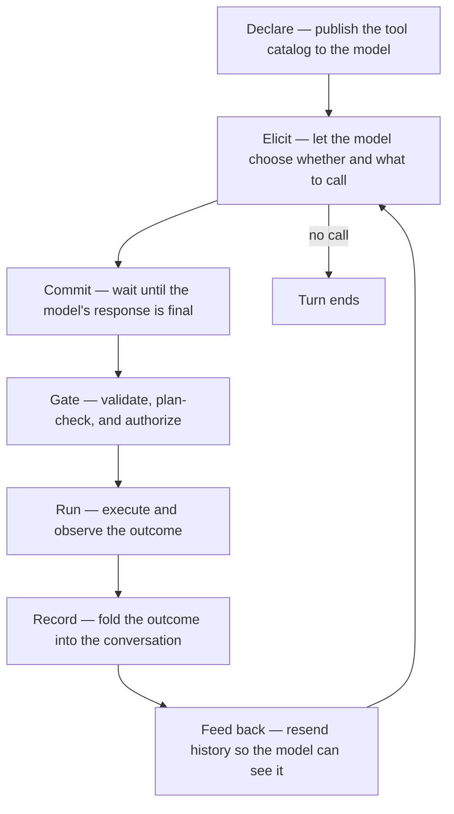

# Tool rounds

A tool call is a round trip between a stateless model and an agent that
owns the conversation. The model proposes a call; the agent shapes it,
gates it, runs it, and folds the outcome back into the conversation so
the next round can see it.

The shape of that round is not a sequence of function calls. It is the
consequence of a few invariants that hold regardless of which provider
sits on the other end of the wire. This page describes those invariants
and the design choices they force. For the wire-level mechanics — HTTP
transaction shape, SSE delta reassembly, the ReAct loop — see
[Request flow](../request-flow.md). For how a turn is driven around tool
rounds, see [Harness architecture](harness.md). For why providers differ,
see [Provider capabilities](../provider-capabilities.md).

## The round, as a concept

The loop closes on the transcript. Every stage either reads from it or
appends to it, and the model's only view of a prior round is what the
transcript says. The rest of this page is about why each stage behaves
the way it does.

## The transcript is the only memory

The model has no state between requests. Everything it "knows" about a
prior tool call is the message history it receives each round, so the
agent resends the full history on every request and treats the
transcript as append-mostly. It is never edited to change meaning.

The catalog is just as ephemeral to the runtime. The tool list is
republished on every request — including the round that carries results
back — because the serving runtime keeps no tool state across turns.
Selection stays automatic: the agent never forces a call; the model
chooses whether and which.

The one disciplined exception to "never edit" is **repair at the
boundary**, and it exists only to keep an append-only history valid
against the wire contract:

- **Attribution.** When a provider has no native function calling, a
  call arrives as plain assistant text. The runtime, however, still
  requires every result message to reference a preceding call. The agent
  satisfies that by attributing the parsed call to the assistant message
  that produced it — and only when that message carries no real native
  call, so a genuine call is never overwritten.
- **Pruning.** Restored or forked sessions can carry results whose
  originating calls were filtered out — hidden harness prompts, a fork
  across code paths. Rather than rewrite history, the agent drops
  unmatched results at the request boundary, so a stale session cannot
  violate the contract.

Both repairs share one principle: history is mended just enough to
satisfy the wire contract, never rearranged to change what happened.

## One registry, two protocols

Tool capability is uneven across providers. Some runtimes accept a
native tool-call field and return structured calls; others speak only
text. neenee answers that with a single tool registry behind two wire
protocols that mean the same thing:

- **Native** — the runtime carries calls in its own structure; streamed
  fragments are reassembled, and nothing executes until the response
  terminates.
- **Fallback** — the model is instructed to emit a call as ordinary
  text, and the agent extracts it after the response completes.

The two paths share one dispatch contract, one permission broker, one
result format, and one loop. Choosing a protocol changes the transport,
not the semantics — which is why a provider without native support is
still fully usable rather than a degraded mode.

Fallback parsing is intentionally strict. The agent looks for a single
top-level object that names a tool and its arguments, and parses the
whole string. It does not trim code fences or scan prose for embedded
calls. The model is *told* to emit the raw object; heuristic rescue
would risk false positives on ordinary text and mask the real failure —
a model that ignored the instruction. A malformed call simply fails to
parse, and the turn ends without an invocation.

Because a fallback call is rendered live as assistant text while it
streams, the agent withdraws it from the visible buffer once it parses,
before drawing the tool step. The native path needs no such withdrawal:
its call deltas never enter the visible text buffer at all.

## Commit before any side effect

Tool side effects are irreversible; provider requests are retryable.
That asymmetry is the whole reason execution is deferred: nothing fires
until the round is *committed* — meaning the model's response has fully
arrived. A stream that errors before completion can be retried without
leaving partial tool state behind.

The corollary, once anything has executed, is that retryable errors
become terminal. Replaying a request after a side effect would risk
running that side effect a second time, so the agent refuses to retry
once the first tool has fired. The boundary between "retry freely" and
"no retry" is exactly that first execution.

## Gates run before execution

Every call crosses the same gating stack before it runs, and the whole
stack sits behind one convergence point so that the native and fallback
paths — and any future tool source — pass through identical checks:

1. **Lookup.** An unknown name returns an error *result*, not an abort.
   The model sees the error and can recover; a typo is not a
   turn-ending failure.
2. **Plan-mode gate.** In Plan mode, calls that mutate state are blocked
   unless they opt in. The default is read-only; a write tool may exempt
   a narrow, declared scope. See [Plan mode](plan-mode.md).
3. **Permission broker.** Write-capable calls are authorized against a
   scoped rule set. A cached *always* rule skips the prompt; otherwise
   the call waits for a decision, and a denial comes back as a result
   that tells the model not to retry. See
   [Harness architecture](harness.md).

Order is load-bearing: a call is validated, plan-checked, and authorized
before it is allowed to do anything. The model never learns which gate
opened or blocked — it only sees the result.

## The model consumes text

Whatever a tool produces, the model only ever reads text. So a result is
deliberately split into two faces:

- a **typed payload**, forwarded to the UI so it can render a shell
  transcript, a code block, a file listing, or a patch faithfully; and
- a **flattened text string**, appended to the transcript, which is all
  the model will see on the next round.

Splitting the two keeps the UI rich without lying to the model: the
transcript carries exactly the text a tool chose to expose, and the UI
carries the structure that text was derived from. Terminal status —
success versus failure — is read from the typed payload, not sniffed
from the text, so a non-zero shell exit is a real failure rather than
something that has to be recognized by an `Error` prefix. For the
decision history behind this split, see
[ADR-0001](../../adr/0001-tool-rendering-redesign.md).

A related split lives in identifiers. The wire requires a result to
reference the call id the runtime issued; the UI wants stable steps
even when a runtime omits ids or emits duplicates. So the wire id and
the UI id are separate namespaces: one satisfies the protocol, the other
keeps the display stable.

## Unbounded by design

A tool-calling loop is **uncapped by design**: the model is free to keep
proposing distinct tool calls until it emits a final assistant message
with no tool call. This matches the codex / claude-code agentic-loop
model — the loop runs until the model itself decides it is done, with
context compaction as the backstop that keeps long turns bounded and
the user able to interrupt at any time (ADR-0009).

The one in-loop guardrail is the **repeated-call guard**: three
consecutive identical calls (same name + same arguments) trip it, the
fourth is rejected as an error, and the turn aborts. The guard resets on
any distinct call or interleaved text, so a productive loop runs on
while a stuck one stops.

This is an execution bound, not a security sandbox. It catches a stuck
loop; it does not constrain what a tool is allowed to do. The safety
surface — authorization, plan gating — is the gates above. For the full
bound table and how it interacts with retry, see
[Request flow](../request-flow.md) and [Harness architecture](harness.md).

Because an uncapped loop can still *appear* stuck (distinct-but-unproductive
calls), long turns are periodically audited by a read-only session-review
sub-agent rather than a round counter; see [Harness architecture → Session
review](harness.md#session-review-adr-0016) and ADR-0016.

## See also

- [Built-in tools](../../reference/tools/index.md) — the catalog that gets declared
- [Request flow](../request-flow.md) — HTTP shape, SSE reassembly, the ReAct loop
- [Provider capabilities](../provider-capabilities.md) — why the protocol splits in two
- [Guided decoding](../guided-decoding.md) — the constrained-decoding layer that produces valid native calls
- [Harness architecture](harness.md) — turn execution, retry, and safety bounds around tool rounds
- [Plan mode](plan-mode.md) — the read-only planning surface and its write exemption
- [How to add a tool](../../how-to/add-a-tool.md) — adding a new tool
