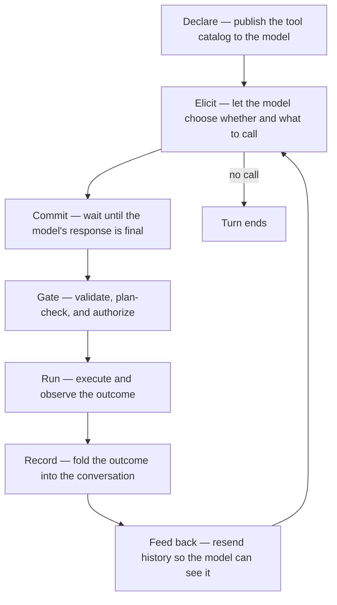

# Turns and rounds

neenee executes a request in two nested layers. A **turn** is the unit the
user perceives: one submitted message, one final reply. A **round** is the
unit the ReAct loop iterates on inside that turn: one model request, plus
the tool work that follows when the model asks for it. One turn is one or
many rounds; one round never spans turns.

The split is not decorative. Different concerns attach to each layer, and
keeping them straight is the key to reading the rest of the canon. For the
control plane that drives a turn, see [Harness architecture](harness.md).

## The two layers

```text
turn  ────────────────────────────────────────────────┐
  │                                                   │
  ├── round 1: model request → tool call → result ──┐ │
  ├── round 2: model request → tool call → result ──┤ │
  ├── round 3: model request → tool call → result ──┤ │
  └── round N: model request → final text (no call) │ │
                                                    │ │
  turn ends ────────────────────────────────────────┘ │
                                                     │
next turn ───────────────────────────────────────────┘
```

A **turn** opens when the user submits a message and closes when the agent
produces a final assistant message that carries no tool call. Everything
between — every model request, every tool execution, every result folded
back into the transcript — belongs to that one turn.

A **round** is one pass through that loop: send the conversation to the
model, let the response commit, and either execute the tool calls it
carries (then loop) or treat it as the turn's answer (then stop). A
trivial turn that needs no tools is a single round. A turn that reads,
edits, and verifies may run several.

The round counter resets at the start of every turn. A separate,
monotonic **turn counter** persists across turns for the concerns that
need to measure passage between turns — plan staleness, pursuit accounting.

## What ends a turn

A turn stops on the first of these conditions:

| Condition | Kind | What the user sees |
|-----------|------|--------------------|
| Final assistant message with no tool call | Natural completion | The reply |
| Repeated-call guard trips | Stuck loop | An error |
| User interrupt | Cancellation | The turn stops where it is |
| Permission denied | Abort | The denied call's result ends the loop |

There is **no per-turn round cap**: distinct tool calls are allowed to run
uncapped, matching the codex / claude-code agentic-loop model (ADR-0009).
Context compaction is the backstop that keeps long turns bounded; the user
can interrupt at any time. The repeated-call guard is the only in-loop
guardrail: three identical calls in a row mean the loop is stuck, so the
fourth is rejected as an error rather than silently swallowed.

For the rest of the safety surface, see [Harness architecture](harness.md).

## What ends a round

A round ends when the model's response commits — when the stream
terminates and the assistant message is final. Up to that boundary,
nothing with side effects has run; the round is still retryable. Once the
response commits, the turn either executes the tool calls it carries and
starts a new round, or treats the message as the answer and ends the turn.

The sections below open up the lifecycle inside a single round:
declaration, gating, execution, and how the outcome re-enters the
transcript.

## The round, as a concept

A tool call is a round trip between a stateless model and an agent that
owns the conversation. The model proposes a call; the agent shapes it,
gates it, runs it, and folds the outcome back into the conversation so
the next round can see it.



The loop closes on the transcript. Every stage either reads from it or
appends to it, and the model's only view of a prior round is what the
transcript says. The sections below are about why each stage behaves the
way it does. For the wire-level mechanics — HTTP transaction shape, SSE
delta reassembly, the ReAct loop — see [Request flow](../request-flow.md).
For why providers differ, see [Provider capabilities](../provider-capabilities.md).

## The transcript is the only memory

The model has no state between requests. Everything it "knows" about a
prior tool call is the message history it receives each round, so the
agent resends the full history on every request and treats the
transcript as append-mostly. It is never edited to change meaning.

The catalog is just as ephemeral to the runtime. The tool list is
republished on every request — including the round that carries results
back — because the serving runtime keeps no tool state across turns.
Selection stays automatic: the agent never forces a call; the model
chooses whether and which.

The one disciplined exception to "never edit" is **repair at the
boundary**, and it exists only to keep an append-only history valid
against the wire contract:

- **Attribution.** When a provider has no native function calling, a
  call arrives as plain assistant text. The runtime, however, still
  requires every result message to reference a preceding call. The agent
  satisfies that by attributing the parsed call to the assistant message
  that produced it — and only when that message carries no real native
  call, so a genuine call is never overwritten.
- **Pruning.** Restored or forked sessions can carry results whose
  originating calls were filtered out — hidden harness prompts, a fork
  across code paths. Rather than rewrite history, the agent drops
  unmatched results at the request boundary, so a stale session cannot
  violate the contract.

Both repairs share one principle: history is mended just enough to
satisfy the wire contract, never rearranged to change what happened.

## One registry, two protocols

Tool capability is uneven across providers. Some runtimes accept a
native tool-call field and return structured calls; others speak only
text. neenee answers that with a single tool registry behind two wire
protocols that mean the same thing:

- **Native** — the runtime carries calls in its own structure; streamed
  fragments are reassembled, and nothing executes until the response
  terminates.
- **Fallback** — the model is instructed to emit a call as ordinary
  text, and the agent extracts it after the response completes.

The two paths share one dispatch contract, one permission broker, one
result format, and one loop. Choosing a protocol changes the transport,
not the semantics — which is why a provider without native support is
still fully usable rather than a degraded mode.

Fallback parsing is intentionally strict. The agent looks for a single
top-level object that names a tool and its arguments, and parses the
whole string. It does not trim code fences or scan prose for embedded
calls. The model is *told* to emit the raw object; heuristic rescue
would risk false positives on ordinary text and mask the real failure —
a model that ignored the instruction. A malformed call simply fails to
parse, and the turn ends without an invocation.

Because a fallback call is rendered live as assistant text while it
streams, the agent withdraws it from the visible buffer once it parses,
before drawing the tool step. The native path needs no such withdrawal:
its call deltas never enter the visible text buffer at all.

## Commit before any side effect

Tool side effects are irreversible; provider requests are retryable.
That asymmetry is the whole reason execution is deferred: nothing fires
until the round is *committed* — meaning the model's response has fully
arrived. A stream that errors before completion can be retried without
leaving partial tool state behind.

The corollary, once anything has executed, is that retryable errors
become terminal. Replaying a request after a side effect would risk
running that side effect a second time, so the agent refuses to retry
once the first tool has fired. The boundary between "retry freely" and
"no retry" is exactly that first execution.

## Gates run before execution

Every call crosses the same gating stack before it runs, and the whole
stack sits behind one convergence point so that the native and fallback
paths — and any future tool source — pass through identical checks:

1. **Lookup.** An unknown name returns an error *result*, not an abort.
   The model sees the error and can recover; a typo is not a
   turn-ending failure.
2. **Write-scope gate.** A per-agent `WriteScope` boundary blocks write tools
   whose target is outside the agent's granted paths — the main agent is
   unrestricted, a subagent is scoped by its profile. See
   [ADR-0028](../../adr/0028-capability-allocation-scoped-writes.md).
3. **Permission broker.** Write-capable calls are authorized against a
   scoped rule set. A cached *always* rule skips the prompt; otherwise
   the call waits for a decision, and a denial comes back as a result
   that tells the model not to retry. See
   [Harness architecture](harness.md).

Order is load-bearing: a call is validated, plan-checked, and authorized
before it is allowed to do anything. The model never learns which gate
opened or blocked — it only sees the result.

## The model consumes text

Whatever a tool produces, the model only ever reads text. So a result is
deliberately split into two faces:

- a **typed payload**, forwarded to the UI so it can render a shell
  transcript, a code block, a file listing, or a patch faithfully; and
- a **flattened text string**, appended to the transcript, which is all
  the model will see on the next round.

Splitting the two keeps the UI rich without lying to the model: the
transcript carries exactly the text a tool chose to expose, and the UI
carries the structure that text was derived from. Terminal status —
success versus failure — is read from the typed payload, not sniffed
from the text, so a non-zero shell exit is a real failure rather than
something that has to be recognized by an `Error` prefix. For the
decision history behind this split, see
[ADR-0001](../../adr/0001-tool-rendering-redesign.md).

A related split lives in identifiers. The wire requires a result to
reference the call id the runtime issued; the UI wants stable steps
even when a runtime omits ids or emits duplicates. So the wire id and
the UI id are separate namespaces: one satisfies the protocol, the other
keeps the display stable.

## Why two layers

The layers exist because the concerns that govern an agent run attach to
different granularities. Measuring everything at the turn level is too
coarse: a single turn can burn the whole context budget if nothing watches
the loop body. Measuring everything at the round level is too fine: the
user does not perceive rounds, and durability that changed mid-loop would
be incoherent.

| Concern | Layer | Why it lives there |
|---------|-------|--------------------|
| Repeated-call guard | Round | A stuck loop is unbounded by default; the guardrail watches each iteration for the one signature of "stuck" (same name + args) |
| Mid-turn context projection | Round | Pruning old tool results between rounds produces a smaller model window before the next request, inside one turn |
| Pre-tool retry safety | Round | A round is retryable until its first side effect; after that, retry is terminal |
| Pursuit token and time accounting | Turn | Cost is booked once the turn's outcome is final, not partway through |
| Plan staleness | Turn | "Turns since the plan was last updated" is the signal that the model has drifted |
| Session durability | Turn | The transcript commits at the turn boundary, never mid-loop |
| Autonomous loop budget | Turn | A pursuit (driven by `/pursue`'s stop-gate) counts stop-gate iterations for status display and durable resume — bounded by the 50-round safety cap, see ADR-0009 and ADR-0015 |

The rule of thumb: if a concern watches the loop body, it is round-scoped;
if it books a result or measures passage of work, it is turn-scoped.

## How the layers show up

The round layer is visible to the user only as live progress. While a turn
runs, the activity bar reports both layers as a structural prefix —
`turn N · round M · <status>` — so the user can see at a glance how far into
the turn the loop has gone. Each tool call renders as a step. When the turn
ends, the round detail collapses into the single user-visible exchange.

The turn layer is the durable shape of the conversation. The transcript is
a sequence of turns; pursuit accounting, plan progress, and the persisted
session all advance at turn boundaries. A resumed session restores whole
turns, never partial rounds.

A sub-agent runs its own turn with its own independent round budget — the
parent's round counter does not move while the child works. See
[Sub-agents](subagents.md).

## A turn of several rounds

A user asks: *fix the bug in `parser.rs` and explain the fix*. One turn,
four rounds:

```text
turn opens
  round 1  read_file(parser.rs)   ← model inspects
  round 2  edit_file(parser.rs)   ← model applies the fix
  round 3  read_file(parser.rs)   ← model verifies the result
  round 4  "The bug was …"        ← final text, no tool call
turn ends
```

Each round sends the full, growing transcript back to the model; the
conversational memory is the transcript the agent resends, not anything
the model remembers. If the transcript grows past the context budget
mid-turn, relief prunes old tool results between rounds — the turn does
not have to end to reclaim space. When round 4 produces plain text with no
tool call, the turn closes, pursuit accounting books the combined token cost
of all four rounds, and the plan's staleness counter advances by one turn.

## See also

- [Harness architecture](harness.md) — turn execution, retry, and the
  full table of safety bounds
- [Request flow](../request-flow.md) — HTTP shape, SSE reassembly, the
  ReAct loop
- [Built-in tools](../../reference/tools/index.md) — the catalog that
  gets declared
- [Provider capabilities](../provider-capabilities.md) — why the protocol
  splits in two (native vs fallback)
- [Guided decoding](../guided-decoding.md) — the constrained-decoding
  layer that produces valid native calls
- [Pursuits](pursuits.md) — turn-scoped token and time accounting
- [Sub-agents](subagents.md) — independent turns and round budgets
  for child agents
- [How to add a tool](../../how-to/add-a-tool.md) — adding a new tool
