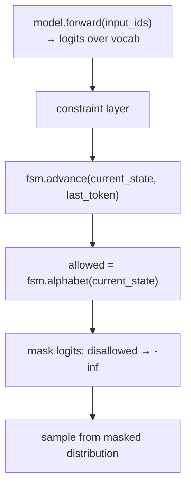

# Guided decoding

Tool calls arrive as well-formed JSON because of a layer of technology that
sits between the model weights and the client. This page explains what that
layer does, how it works, and why neenee can rely on it without implementing
itself.

For the higher-level capability model, see
[Provider capabilities](provider-capabilities.md). For where neenee's
adapters assume this layer is present, see
[Tool protocol](tool-protocol.md).

## The problem

A language model is an autoregressive token sampler. At every step it
produces a probability distribution over the vocabulary and the runtime
samples one token. Nothing in the sampling process itself knows about JSON
syntax, schema conformance, or the structure of a tool call.

Two failure modes follow:

- **Syntactic.** The model emits `{"path": "src/lib.rs"` (missing closing
  brace) or `{"path": src/lib.rs}` (unquoted value). The bytes are not
  valid JSON. `serde_json::from_str` fails and the turn aborts.
- **Semantic.** The model emits `{"path": "src/lib.rs", "extra": 7}` against
  a schema that disallows `additionalProperties`. The JSON parses but the
  tool rejects the call.

Tool-use fine-tuning reduces both failure modes by making compliant output
high-probability, but it cannot eliminate them. A long argument, an unusual
path, or a distribution shift can push the model off the compliant path.
Sampling is stochastic; "high probability" is not "guaranteed."

## Constrained decoding

Constrained (or guided) decoding guarantees compliance by intervening in
sampling. The intervention is mechanical, not statistical:

Every token that would leave the language of legal outputs is rendered
impossible before sampling happens. The model still chooses among the
survivors, so it retains semantic freedom (which path string, which tool
name) but loses the ability to break the grammar.

The guarantee is total: if the FSM is correctly compiled from the schema,
no sequence of samples can produce invalid output. This is what
distinguishes constrained decoding from prompt engineering or few-shot
example injection, which only nudge probabilities.

## From schema to FSM

The constraint layer needs a deterministic description of the legal
language. Three description formats are common:

| Format | Expressiveness | Typical source |
|--------|----------------|----------------|
| JSON Schema | High (objects, arrays, enums, `oneOf`, numeric ranges) | OpenAI `tools` field, pydantic models |
| Regular expression | Medium (linear patterns, character classes) | Field-level constraints, phone numbers, dates |
| Context-free grammar | Highest (nested structures, recursion) | Domain-specific languages, SQL subsets |

Most tool-calling traffic uses JSON Schema. The schema is compiled into a
finite-state machine once per request and reused across every token in the
response. Two compilation challenges dominate:

- **Token vs byte boundary.** FSMs operate on bytes or characters; models
  emit tokens that may encode several bytes (a single BPE token can cover
  `src/lib`). The constraint layer must pre-compute, for every state,
  which token IDs correspond to byte sequences the FSM would accept from
  that state. This *token alphabet* is the expensive part of compilation
  and is cached aggressively.
- **Schema subset.** Full JSON Schema (with `$ref`, `unevaluatedProperties`,
  conditional `if/then/else`) is hard to compile. Every implementation
  supports a subset; the rest is either rejected at compile time or
  ignored silently. Tool schemas in practice stay within the supported
  subset.

Once compiled, the per-token cost is constant: one FSM transition plus a
logit mask. The runtime overhead is typically a few percent of the forward
pass, dominated by the masking operation rather than the FSM itself.

## Implementation landscape

The major serving runtimes ship at least one backend. The differences are
in language, performance, and schema coverage.

| Backend | Language | Strengths | Used by |
|---------|----------|-----------|---------|
| Outlines | Python + PyTorch | General (regex, grammar, schema); portable | vLLM (optional), LM Studio, custom |
| xgrammar | C++ | Fastest schema compilation; adaptive FSM for recursion | vLLM (default since 0.6), MLC stack |
| lm-format-enforcer | Python | Easy integration; buildable parsers | vLLM, text-generation-inference |
| SGLang compressed FSM | Rust + C++ | Byte-level regex FSM, tightly integrated | SGLang |
| TensorRT-LLM outlines | C++ | GPU-side logit masking | TensorRT-LLM |
| guidance | Python | Templated generation with embedded constraints | Microsoft ecosystem |

For neenee's purposes the backend does not matter. What matters is whether
the serving runtime enables guided decoding at all and whether it is wired
to the `tools` field of the OpenAI Chat Completions request. vLLM, SGLang,
TGI, TensorRT-LLM, and every hosted gateway (OpenAI, DashScope, Zhipu,
Moonshot, Volcengine Ark) do so; a bare `transformers` loop or a naive
llama.cpp build does not.

## Chat templates

Constrained decoding produces a JSON string. The model still needs to know
*when* to produce one and *which* schema applies. That is the job of the
chat template.

A chat template is a Jinja2 fragment stored in the model's
`tokenizer_config.json` under the `chat_template` field. When the serving
runtime receives a request with a `tools` array, it renders the template
with the messages and tools, producing the prompt string the model
actually sees. Every model family has its own tool-use template:

- Hermes-style models emit `<tool_call>...</tool_call>` blocks inside the
  assistant turn.
- Llama-3 tool models use a special `<|python_tag|>` sentinel followed by
  a JSON dict.
- Qwen function-calling models wrap calls in `<tool_call>` tags.
- Mistral models use a `[TOOL_CALLS]` marker.

The diversity is why neenee never builds tool prompts itself. Sending the
OpenAI-shaped `tools` field and trusting the serving runtime to render the
correct template keeps the client model-agnostic. A misconfigured template
(a Llama-3 template applied to Hermes weights, or vice versa) produces a
model that ignores tools entirely, even with perfect guided decoding.

## Why neenee does not implement this

neenee is a client. It cannot do guided decoding because it never sees the
logits. The OpenAI Chat Completions contract exposes only the sampled
text, not the per-token probability distribution. Constrained decoding
must run inside the serving runtime where the logits live.

This is the load-bearing assumption behind `OpenAIProvider`. When
`prepare_tools` injects the `tools` field (`crates/neenee-core/src/
providers.rs:167-170`), it is implicitly asserting two things about the
upstream runtime:

1. The runtime renders a tool-use chat template for the requested model.
2. The runtime applies guided decoding to the tool-call region of the
   response.

If either assumption fails, the model may still produce tool calls (its
weights are tool-tuned) but with no syntactic guarantee. The client then
faces occasional parse failures. neenee's universal fallback
([Tool protocol](tool-protocol.md)) is the graceful degradation for
exactly this case: when guided decoding is absent or unreliable, the agent
parses JSON out of assistant text and accepts that some calls will be
malformed.

## Why both layers are necessary

| Layer | Decides | Cannot decide |
|-------|---------|---------------|
| Tool-use training | Whether to call a tool, which one, what arguments | Whether the bytes will parse |
| Guided decoding | Whether the bytes parse and conform to the schema | Whether the arguments are correct |

Training without guided decoding produces a model that usually does the
right thing but occasionally emits `{"path": src/lib.rs}` and breaks the
client. Guided decoding without training produces output that always
parses but frequently contains fabricated field names or nonsensical
values. The hosted gateways and mature self-hosted stacks combine both:
fine-tuned weights plus a constraint backend, configured through the same
`tools` field.

This is why "mainstream support for tools" looks uniform from the client
side. The protocol is standardized; the heavy lifting happens behind the
same API regardless of vendor.

## See also

- [Provider capabilities](provider-capabilities.md) — how neenee maps this
  layer into its adapter taxonomy
- [Tool protocol](tool-protocol.md) — what neenee does with the tool calls
  this layer produces
- [Request flow](request-flow.md) — how the resulting `tool_calls` field
  drives the ReAct loop
- [Providers](../reference/providers.md) — which providers assume guided
  decoding is present
