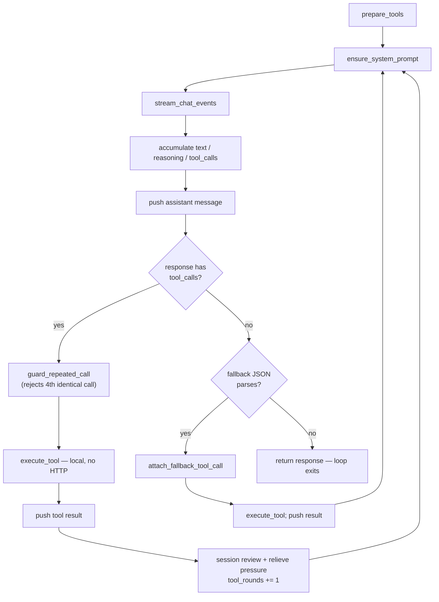

# Request flow

A user turn is a sequence of HTTP transactions driven by the ReAct loop.
This page documents the byte-level shape of each transaction and how the
message array evolves across the loop.

For the tool protocol that decides *when* a tool call appears in a
response, see [Tool rounds](agent-design/turns-and-rounds.md). For the high-level turn
steps, see [Harness architecture](agent-design/harness.md). For which providers speak
this contract, see [Providers](../reference/providers.md).

## One HTTP transaction

Every round of the loop is one independent HTTP request to the provider's
chat completions endpoint. The provider is stateless across rounds; the
full conversation history is re-sent each time.

### Request shape

```text
POST /v1/chat/completions HTTP/1.1
Authorization: Bearer <key>
Content-Type: application/json

{
  "model": "<model-id>",
  "stream": true,
  "messages": [
    {"role": "system",    "content": "<harness system prompt>"},
    {"role": "user",      "content": "<user prompt>"},
    {"role": "assistant", "content": "...", "tool_calls": [{"id": "...", "type": "function", "function": {"name": "...", "arguments": "..."}}]},
    {"role": "tool",      "tool_call_id": "...", "content": "<tool result>"}
  ],
  "tools": [<full schema set>],
  "tool_choice": "auto"
}
```

Two body fields are conditional on whether the provider declares tool
schemas:

| Field | When present |
|-------|--------------|
| `tools` | the cached schema set is non-empty |
| `tool_choice` | same condition as `tools` |

When the provider has no native function calling (`GeminiProvider`,
`LlamaServerProvider`), neither field is sent and the body uses a
different shape. See [Tool rounds](agent-design/turns-and-rounds.md) for the fallback.

Orphan `tool` messages whose `tool_call_id` has no matching preceding
assistant `tool_calls` are filtered before the body is serialized. This
keeps the runtime contract satisfied on restored or forked sessions.

### Response shape

```text
HTTP/1.1 200 OK
Content-Type: text/event-stream
Transfer-Encoding: chunked

data: {"choices":[{"delta":{"role":"assistant"}}]}
data: {"choices":[{"delta":{"content":"Let me"}}]}
data: {"choices":[{"delta":{"content":" read"}}]}
data: {"choices":[{"delta":{"tool_calls":[{"index":0,"id":"call_1","function":{"name":"read_file","arguments":"{\"path\":"}}]}}]}
data: {"choices":[{"delta":{"tool_calls":[{"index":0,"function":{"arguments":"\"src/lib.rs\"}"}}]}}]}
data: {"choices":[{"delta":{},"finish_reason":"tool_calls"}]}
data: [DONE]
```

The response is **one** HTTP message. `Transfer-Encoding: chunked` lets the
server flush each `data:` line as it is generated; the client does not wait
for the body to complete before reading. This is standard HTTP/1.1 (or
HTTP/2 streaming) and is the mechanism OpenAI-compatible servers use to
stream tokens.

neenee reads the stream as a byte stream and splits on newlines. Each
`data:`-prefixed line is one SSE event. The literal `data: [DONE]`
terminates the stream.

### SSE event shapes

Each `data:` payload is parsed for three optional fields in
`choices[0].delta`, and a typed event is emitted for each non-empty field:

| Delta field | Reconstructed into |
|-------------|--------------------|
| `content` | assistant visible text |
| `reasoning_content` | reasoning text |
| `tool_calls[]` | tool calls (with `index`, `id`, `name`, `arguments`) |

A single delta may carry any combination of the three. A delta with an
empty `content` and no `tool_calls` produces no event. The terminal chunk
usually carries `finish_reason` (`stop`, `tool_calls`, `length`) and an
empty `delta`.

The `tool_calls` array in a delta is sparse: one SSE line may contain only
`index: 0` with an `id` and `name`, the next line only `index: 0` with a
fragment of `arguments`, and a later line `index: 1` for a second call. The
agent never assumes that a single delta contains a complete call.

## Tool call reassembly

Tool calls arrive as fragments keyed by `delta.tool_calls[].index`. A
single call may be split across many SSE events: the first fragment
typically carries `id` and `function.name`; subsequent fragments carry
pieces of `function.arguments` that must be concatenated.

The streaming loop keeps one slot per `index`, growing the slot list as
higher indices appear. Each fragment appends to its slot: `id` and `name`
when present, and `arguments` always. Because slots are addressed by
`index`, parallel calls in a single response assemble correctly regardless
of interleaving order.

Some providers emit `id` and `name` only in the first fragment of a call;
later fragments carry just an `arguments` piece. The reassembler treats
both as optional and concatenates `arguments` across all fragments for a
given `index`.

Reassembly completes only when the stream ends. After `data: [DONE]` the
agent performs three cleanup steps before any side effects occur:

1. Drop slots whose `name` is still empty — some providers emit
   zero-valued `tool_calls` deltas that never resolve into a real call.
2. Backfill any empty `id` with a generated identifier so the following
   `tool` message has a valid `tool_call_id` to reference.
3. Build the assistant message (content plus the reassembled `tool_calls`)
   and append it to the history; only then are the tool calls executed.

Side effects never fire mid-stream. This is what makes retry safe: a stream
that errors before `[DONE]` can be re-issued without leaving partial tool
state behind. Once any tool has executed, retryable errors become terminal
(see [Retry interaction](#retry-interaction)).

## The ReAct loop

The loop runs identically for interactive (streaming) and headless
(non-streaming) turns; only the transport differs.



The loop has **no per-round cap**. The earlier `MAX_TOOL_ROUNDS = 32`
hard limit was removed in [ADR-0009](../../adr/0009-uncapped-agentic-loop.md);
the loop now runs until the model emits a final assistant message with no
tool call, with the repeated-call guard, periodic session review
([ADR-0016](../../adr/0016-session-review-over-round-counting.md)), and
context compaction as backstops.

### Tool dispatch

The branching after the assistant message differs by transport. For a
native tool-call round, neenee emits one tool-call event per call up front,
executes all calls concurrently, and records the results in input order.
For a text-fallback round it parses the assistant `content` as JSON,
optionally retracts the raw JSON from the UI, promotes the parsed call onto
the assistant message as a synthetic `tool_calls` entry, and executes a
single call.

In both cases the actual side-effecting work goes through one path: tool
lookup, the write-scope gate, the permission broker, then execution.

### Messages evolution

The model has no memory between requests. What it "knows" about prior
tool calls is entirely a function of the `messages` array neenee
re-sends each round. A turn that reads a file, edits it, and summarizes
produces three HTTP transactions:

**Request 1** — the user turn opens the loop.

```text
messages: [
  {role: system,    content: "<harness system prompt>"},
  {role: user,      content: "Fix the bug in parser.rs and explain it"}
],
tools: [<all schemas>]
```

Response carries `tool_calls: [read_file("src/parser.rs")]`,
`finish_reason: "tool_calls"`. neenee executes `read_file` locally and
appends the result.

**Request 2** — same endpoint, expanded history.

```text
messages: [
  {role: system,    content: "<harness system prompt>"},
  {role: user,      content: "Fix the bug in parser.rs and explain it"},
  {role: assistant, content: "I'll read the file first.",
                    tool_calls: [{id: "call_1", function: {name: "read_file", arguments: "{\"path\":\"src/parser.rs\"}"}}]},
  {role: tool,      tool_call_id: "call_1", content: "<file contents>"}
],
tools: [<all schemas>]   ← same set, re-sent verbatim
```

Response carries `tool_calls: [edit_file(...)]`. neenee executes the
edit and appends the result.

**Request 3** — history now contains two tool rounds.

```text
messages: [
  ...,
  {role: assistant, tool_calls: [{id: "call_2", function: {name: "edit_file", arguments: "..."}}]},
  {role: tool,      tool_call_id: "call_2", content: "<edit applied>"}
],
tools: [<all schemas>]
```

Response carries plain text `content: "The bug was ..."`,
`finish_reason: "stop"`. No `tool_calls` field. The loop exits and the
assistant message becomes the turn's final answer.

The `tools` array is byte-identical across all three requests. The
`messages` array grows monotonically; neenee never edits prior messages
(except the attribution step described in
[Tool rounds](agent-design/turns-and-rounds.md)).

### Exit conditions

The loop returns a final assistant message when any of these holds:

| Condition | Result |
|-----------|--------|
| Response has no `tool_calls` and no fallback JSON parses | Success; assistant text is the answer |
| A fourth consecutive identical tool call is rejected | Error; turn aborts |
| Provider or tool pipeline returns an error | Error; turn aborts |
| Context overflow before any tool event | Compact and retry once |

### Safety bounds

Distinct tool rounds are uncapped — the loop runs until the model emits a
final assistant message, with context compaction as the backstop
([ADR-0009](../../adr/0009-uncapped-agentic-loop.md)):

- After three consecutive identical tool calls (same name and arguments),
  the fourth is rejected with an error. Distinct calls and interleaved text
  reset the counter.

This is an execution bound, not a security sandbox. See
[Harness architecture](agent-design/harness.md) for the full safety surface.

## Fallback variant

When the provider has no native function calling the response never
carries a `tool_calls` field. Instead the model is instructed to emit the
call as ordinary assistant text:

```text
{"tool": "read_file", "arguments": {"path": "src/parser.rs"}}
```

After the stream completes, neenee extracts the JSON from the assistant
`content` and promotes the parsed call onto the preceding assistant message
as a synthetic `tool_calls` entry, so the next request's `messages` array
carries a valid `tool_calls` / `tool_call_id` pair even though the original
response was plain text.

The resulting `messages` evolution is identical to the native path. The
only difference is whether the tool call arrives as a structured
`tool_calls` field or is parsed out of `content`. See
[Tool rounds](agent-design/turns-and-rounds.md) for the parsing rules and their limits.

## Retry interaction

Retry lives at the turn level, not inside the provider. A retryable failure
(HTTP 408, 429, 5xx, connection, timeout) is wrapped in a retryable error
and re-issued after backoff.

Two invariants shape the interaction between retry and the ReAct loop:

- **Pre-tool retry is safe.** If the stream errors before any tool has
  executed, the entire request can be re-issued. No side effects have
  occurred; the `messages` array is unchanged.
- **Post-tool retry is terminal.** Once any tool has run in the current
  round, retryable errors become terminal. Re-issuing would risk replaying
  side effects (a second file write, a second shell command).

The deferred-execution rule from [Tool call reassembly](#tool-call-
reassembly) is what makes the first invariant hold. Because tools only
fire after `[DONE]`, a mid-stream failure always lands in the safe
pre-tool window.

Partial streamed assistant text is withdrawn from the visible transcript
before a retry so the user does not see a half-finished answer followed
by a fresh one.

## See also

- [Tool rounds](agent-design/turns-and-rounds.md) — schema injection and fallback mechanics
- [Provider capabilities](provider-capabilities.md) — why providers differ
  on streaming and tool support
- [Harness architecture](agent-design/harness.md) — turn execution, retry, safety bounds
- [Providers](../reference/providers.md) — endpoint catalog
