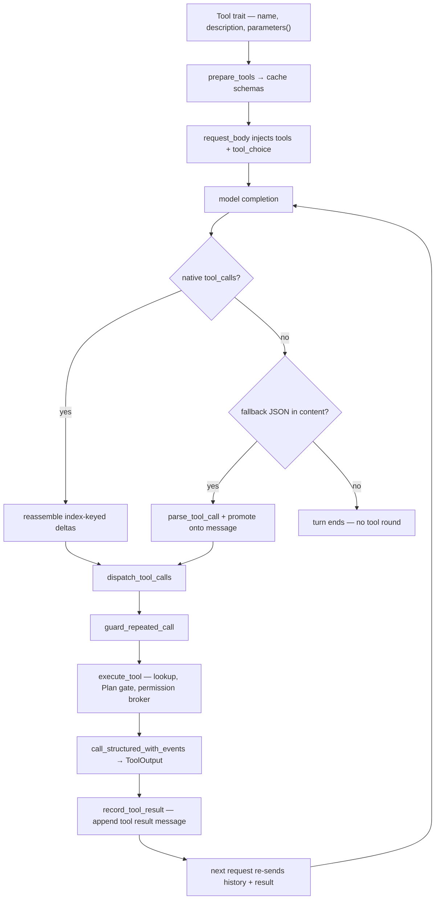
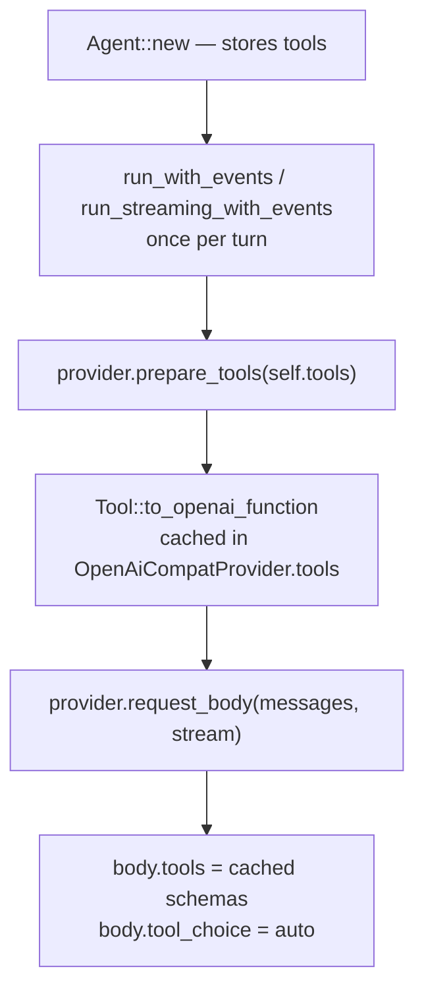

# Tool lifecycle

A tool call is a round trip: the agent declares a tool's schema to the
model, the model decides to invoke it, the agent reassembles the call,
gates it through permissions, executes it, records the result, and feeds
that result back to the model. This page walks that whole loop end to end
and explains why each stage behaves the way it does.

For the HTTP and ReAct-loop mechanics that surround tool rounds, see
[Request flow](request-flow.md). For the tool catalog and per-tool
schemas, see [Built-in tools](../reference/tools.md). For which providers
speak which path, see [Providers](../reference/providers.md) and
[Provider capabilities](provider-capabilities.md).

## The round trip



The loop is driven by `Agent::run_streaming_with_events` (interactive)
and `Agent::run_with_events` (headless) in `crates/neenee-core/src/lib.rs`.
Both share one dispatcher, `Agent::dispatch_tool_calls`, so the dispatch
contract — repeated-call guard, up-front events, ordered results — is
identical regardless of transport.

## Schema

Every tool implements the `Tool` trait (`crates/neenee-core/src/lib.rs`).
Three methods define what the model sees:

```rust
pub trait Tool: Send + Sync {
    fn name(&self) -> &str;
    fn description(&self) -> &str;
    fn parameters(&self) -> serde_json::Value;
    // ...
}
```

`parameters()` returns a JSON Schema object — the exact object the model
receives. No tool transforms it. `Tool::to_openai_function` wraps that
object in the OpenAI function envelope:

```rust
serde_json::json!({
    "type": "function",
    "function": {
        "name": self.name(),
        "description": self.description(),
        "parameters": self.parameters(),
    }
})
```

No tool overrides `to_openai_function`. The schema the model sees is
exactly `parameters()`. For the per-tool schema tables, see
[Built-in tools](../reference/tools.md).

### Request-scoped declaration

Schemas are declared on every request and never cached across turns by
the serving runtime. The flow lives in the provider adapter:



`OpenAiCompatProvider::prepare_tools` (`crates/neenee-core/src/providers.rs`)
collects each tool's `to_openai_function()` into a `Vec<Value>` held in a
`Mutex<Option<…>>` for the turn. Every ReAct round — including the round
that returns tool results to the model — re-sends the full schema set
alongside the full message history. The runtime is stateless across
turns.

Providers that do not override `prepare_tools` (`GeminiProvider`,
`LlamaServerProvider`, `MockProvider`) keep the trait default no-op and
never send a `tools` field. Tool calls on those providers travel only
through the text fallback below.

## Declaring tools to the model

`OpenAiCompatProvider::request_body` (`providers.rs`) serializes the
messages and conditionally adds the tool fields:

```rust
if let Some(tools) = tools.as_ref().filter(|tools| !tools.is_empty()) {
    body["tools"] = json!(tools);
    body["tool_choice"] = "auto".into();
}
```

| Field | When present | Source |
|-------|--------------|--------|
| `tools` | cached schema set is non-empty | `prepare_tools` cache |
| `tool_choice` | same condition as `tools` | hard-coded `"auto"` |

`tool_choice` is always `auto`: the model decides whether and which tool
to call. neenee never forces a call. When the provider has no native
function calling, neither field is sent and the body uses the text
fallback shape.

## The model emits a call

The response arrives through one of two paths. Both share the same
schema declaration and the same `ToolCall` reassembly contract; only the
response parsing differs.

### Native function calling

OpenAI-compatible providers return tool calls inside the response. The
streaming path is `OpenAiCompatProvider::stream_chat_events`
(`providers.rs`); the non-streaming path is `Provider::chat`, which reads
`choices[0].message.tool_calls` complete in one round trip.

Streaming deltas are parsed by `parse_openai_stream_data` (`providers.rs`),
which reads three optional fields from `choices[0].delta`:

| Delta field | Event emitted | Reconstructed into |
|-------------|---------------|---------------------|
| `content` | `ProviderStreamEvent::TextDelta` | assistant text |
| `reasoning_content` | `ProviderStreamEvent::ReasoningDelta` | reasoning text |
| `tool_calls[]` | `ProviderStreamEvent::ToolCallDelta` per `index` | tool calls |

Tool calls arrive as fragments keyed by `delta.tool_calls[].index`. A
single call is usually split across many SSE events: the first fragment
carries the `id` and `function.name`, later fragments carry pieces of
`function.arguments` that must be concatenated. The streaming loop in
`Agent::run_streaming_with_events` accumulates them into a `Vec<ToolCall>`
that grows to `index + 1` so parallel calls can arrive in any order:

```rust
while calls.len() <= index {
    calls.push(ToolCall { id: String::new(), name: String::new(), arguments: String::new() });
}
let call = &mut calls[index];
if let Some(id) = id { call.id.push_str(&id); }
if let Some(name) = name { call.name.push_str(&name); }
call.arguments.push_str(&arguments);
```

Reassembly completes only when the stream ends. After `data: [DONE]` the
agent runs three cleanup steps before any side effect:

```text
calls.retain(|c| !c.name.is_empty())      // drop zero-valued placeholder slots
for call in calls { if call.id.is_empty() { call.id = "call_<uuid>" } }
build assistant Message { tool_calls: Some(calls) }  // None when empty
```

Slots with an empty `name` are discarded because some providers emit
zero-valued `tool_calls` deltas. Empty `id` fields are backfilled so the
following `tool` message has a valid `tool_call_id` to reference.

Two identifier spaces are worth distinguishing. The provider's `call.id`
is preserved in the assistant `Message` and reused as the `tool_call_id`
of the result message, because OpenAI-compatible runtimes require every
`tool` message to reference a preceding assistant `tool_calls` entry. The
UI, however, receives fresh event ids generated inside
`dispatch_tool_calls`, so tool-step cards stay stable even when a provider
omits ids or emits duplicates.

For the byte-level SSE sequence and the full HTTP transaction shape, see
[Request flow](request-flow.md).

### Text fallback

When the provider has no native function calling, the model is instructed
to emit a JSON tool call as ordinary assistant text. The agent extracts
it after the response completes.

`Agent::parse_tool_call` (`lib.rs`) expects a top-level JSON object with a
`"tool"` string key:

```text
{"tool": "read_file", "arguments": {"path": "src/lib.rs"}}
```

The `"arguments"` key is optional and defaults to `{}`. The parser calls
`text.trim()` then `serde_json::from_str` on the entire trimmed string.
It does **not** strip code fences and does **not** scan for embedded JSON
substrings. A model that wraps the call in ` ```json … ``` ` fails to
parse and the turn ends without a tool invocation.

#### Promoting a fallback call to native tool_calls

OpenAI-compatible runtimes require every `tool` message to reference a
preceding assistant `tool_calls` entry. A fallback call extracted from
text has no such entry. `Agent::attach_fallback_tool_call` promotes the
parsed call onto the preceding assistant message:

```rust
if last.role == Role::Assistant && last.tool_calls.is_none() {
    last.tool_calls = Some(vec![call.clone()]);
}
```

The guard ensures a real native call is never overwritten. After
promotion the next request body carries a valid `tool_calls` /
`tool_call_id` pair even though the original response was plain text.

#### Transcript withdrawal

Fallback JSON is rendered to the user as live assistant text while the
model streams it. Once `parse_tool_call` succeeds the agent emits
`AgentEvent::AssistantDiscard` (only when text was actually streamed) so
the TUI withdraws the raw JSON before drawing the tool card. The native
streaming path does not need this because tool-call deltas never enter the
visible text buffer.

## Dispatch

`Agent::dispatch_tool_calls` (`lib.rs`) is the single branch point shared
by both loops. It returns `true` when a tool round ran (so the caller
increments `tool_rounds` and continues) and `false` when the response was
a final answer.

For a **native** round, the dispatcher:

1. Runs `guard_repeated_call` against every call up front.
2. Emits one `AgentEvent::ToolCall` per call, each with a fresh
   `call_<uuid>` id, before any executes.
3. Executes all calls concurrently via `execute_tools_concurrent`, which
   forwards interleaved events in real time and returns results in input
   order.
4. Records each result through `record_tool_result` in the same input
   order.

For a **fallback** round, the dispatcher parses the assistant `content`,
optionally emits `AssistantDiscard`, promotes the call with
`attach_fallback_tool_call`, emits one `ToolCall` event, and executes the
single call through `execute_tool_evented`.

### Repeated-call guard

`guard_repeated_call` (`lib.rs`) tracks the previous `(name, arguments)`
pair. After `MAX_REPEATED_TOOL_CALLS` (3) consecutive identical calls the
next is rejected with an error and the turn aborts. A distinct call or
interleaved assistant text resets the counter.

## Execution

Both paths converge on `Agent::execute_tool` (`lib.rs`). The dispatcher
performs four stages in order.

1. **Lookup.** The tool is found by name. An unknown name returns
   `ToolOutput::Text("Error: Tool '{}' not found")` rather than aborting
   the turn — the model sees the error and can recover.
2. **Plan-mode gate.** In `AgentMode::Plan`, a call that fails
   `Tool::allowed_in_plan_mode(arguments)` returns a blocking message.
   Read-only tools pass by default; `write_file` and `edit_file` override
   it to permit writes under `.neenee/plans/`. See
   [Plan mode](plan-mode.md).
3. **Permission broker.** A `ToolAccess::Write` tool is routed through
   the broker. The scope is `Tool::permission_scope(&arguments)` — a path
   for file tools, the full command for `bash`, or `"*"` for tools that do
   not override the default. A cached `Always` rule for `(tool, scope)`
   skips the prompt; otherwise a `PermissionRequest` is emitted and the
   call awaits `Once`, `Always` (caches the rule), or `Reject` (returns a
   denial message and tells the model not to retry).
4. **Invocation.** `Tool::call_structured_with_events` runs and returns a
   typed [`ToolOutput`](`crate::ToolOutput`). Sub-agent events from `task`
   are forwarded as `AgentEvent::SubTask`; incremental output (e.g. `bash`
   stdout) streams as `AgentEvent::ToolStream` while the tool runs.

### Structured output

`ToolOutput` (`crates/neenee-core/src/tool_output.rs`) carries typed
variants — `Text`, `Error`, `Shell`, `Code`, `Listing`, `Matches`,
`Patch`. The trait default delegates to the legacy `Tool::call` and wraps
the string as `Text`, so unmigrated tools keep working; migrated tools
override `call_structured` to return richer variants. `to_text()` flattens
any variant to the legacy display string, and `is_error()` flags failure
from data (`Error`, or a `Shell` with a non-zero exit) instead of
string-sniffing. See
[ADR-0001](../adr/0001-tool-rendering-redesign.md).

## Recording results

`Agent::record_tool_result` (`lib.rs`) accounts for, surfaces, and
persists a single result:

```rust
on_event(AgentEvent::ToolResult {
    id: call_id.to_string(),
    name: call.name.clone(),
    output: text.clone(),          // to_text() flattening — legacy display string
    structured: result.clone(),    // typed payload
    duration_ms,
});
messages.push(Message::tool_result(call, format!("[{} result]:\n{}", call.name, text)));
```

`Message::tool_result` (`crates/neenee-core/src/message.rs`) stamps the
`tool_call_id` from the originating call so the result references the
preceding assistant `tool_calls` entry. The terminal status (`Ok` /
`Failed`) is derived from the structured payload via `is_error()`,
replacing the old `output.starts_with("Error")` heuristic that
misclassified `Exit N` bash failures as success.

Two side events fire alongside the result when relevant: `GoalUpdated`
(after `goal_checklist`) and `ModeChanged` (after `plan_enter` /
`plan_exit`), so the TUI refreshes goal and mode state without polling.

## Feeding results back

The appended `tool` message becomes part of the `messages` array the
agent re-sends on the next round. The model has no memory between
requests; what it "knows" about a prior tool call is entirely the
`tool_calls` / `tool_call_id` pair it sees in history. The `tools` schema
array is byte-identical across rounds; `messages` grows monotonically and
is never edited, except for the fallback promotion above.

### Orphan result filtering

Restored or forked sessions may carry `tool` results whose originating
assistant `tool_calls` were filtered out — hidden harness prompts,
text-fallback promotions on a different code path. OpenAI-compatible
runtimes reject any `tool` message whose `tool_call_id` has no match.
`request_body` drops orphans at the boundary so a stale session cannot
fail with `tool_call_id is not found`:

- A first pass records every `tool_call.id` from preceding assistant
  messages.
- A `Tool` message is kept only if its `tool_call_id` is non-empty and
  present in that set.
- Empty assistant messages are filtered by `valid_provider_message`
  (`providers.rs`).

## Bounds and exit

Two execution bounds prevent runaway loops (`crates/neenee-core/src/lib.rs`):

| Bound | Value | Effect |
|-------|-------|--------|
| `MAX_TOOL_ROUNDS` | 32 | A single turn cannot exceed 32 tool rounds; the turn aborts. |
| `MAX_REPEATED_TOOL_CALLS` | 3 | The fourth consecutive identical call aborts the turn. |

These are execution bounds, not a security sandbox. The full exit-condition
table, the retry interaction, and the safety surface are documented in
[Request flow](request-flow.md) and [Harness architecture](harness.md).

One invariant is tool-specific: side effects never fire mid-stream.
`execute_tool` runs only after the stream terminates, so a stream that
errors before `[DONE]` can be retried without leaving partial tool state.
Once any tool has executed, retryable errors become terminal to avoid
replaying side effects.

## Design notes

- **Fallback exists because capability is uneven.** Gemini and LlamaServer
  cannot accept a `tools` field through neenee's current adapters, but the
  model behind them is still useful. The text protocol keeps the same
  tool registry, permission broker, and result-message format as the
  native path.
- **Orphan filtering exists because sessions are durable.** Dropping
  orphans at the request boundary keeps the runtime contract satisfied
  without rewriting history.
- **Side-effect ordering is why tool execution is deferred.** Executing
  mid-stream would make retry unsafe: a partially streamed call could fire
  a write before the stream errors out. Waiting for `[DONE]` guarantees
  retryable failures never produce tool side effects.
- **Code fences are not stripped because the model is told not to emit
  them.** The system prompt instructs the model to emit raw JSON when
  falling back. Models that ignore the instruction are out of scope;
  heuristic JSON extraction risks false positives on ordinary prose that
  happens to contain a `{"tool": ...}` substring.

## See also

- [Built-in tools](../reference/tools.md) — the schemas that get declared
- [Request flow](request-flow.md) — HTTP transaction shape, SSE events,
  and the ReAct loop
- [Provider capabilities](provider-capabilities.md) — why the protocol
  splits into native and fallback
- [Guided decoding](guided-decoding.md) — the constrained-decoding layer
  that produces valid native tool calls
- [Harness architecture](harness.md) — turn execution, retry, safety
  bounds around tool rounds
- [How to add a tool](../how-to/add-a-tool.md) — implementing the `Tool`
  trait
