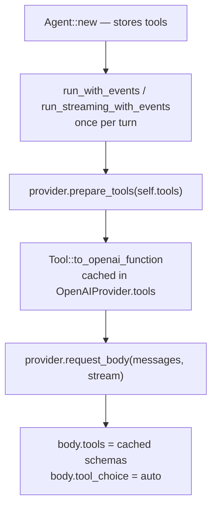
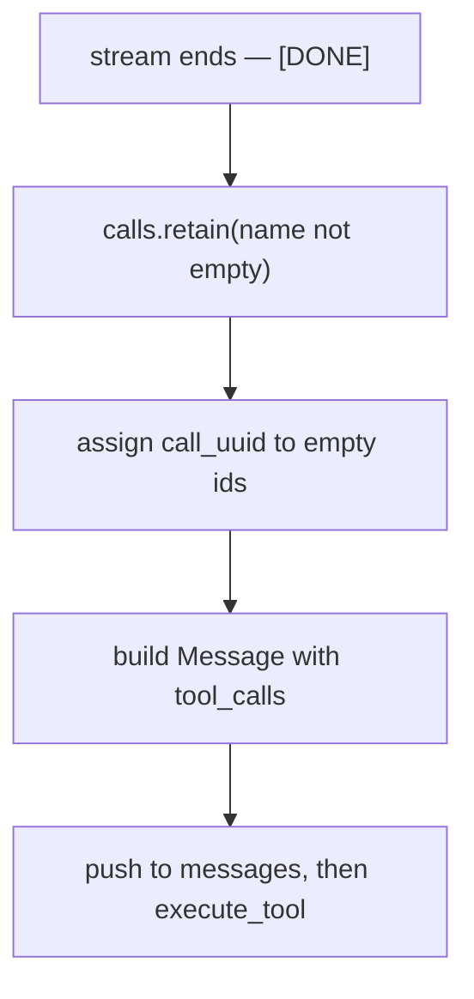

# Tool protocol

This page documents the wire-level protocol neenee uses to declare tools to
the provider, transport tool calls, and fall back when a provider has no
native function calling. For which providers support which path, see
[Providers](../reference/providers.md). For the capability model behind
these choices, see [Provider capabilities](provider-capabilities.md).

## Schema declaration

Tool schemas are declared by the client and consumed by the serving runtime
on every request. They are never cached across turns by the runtime.



`Tool::to_openai_function` (`crates/neenee-core/src/lib.rs`) wraps each
tool's `parameters()` JSON Schema in the OpenAI function envelope
`{"type":"function","function":{"name","description","parameters"}}`. No
tool overrides this default; the schema the model sees is exactly what
`parameters()` returns.

Schemas are request-scoped. Every ReAct round — including the round that
returns tool results to the model — re-sends the full schema set alongside
the full message history. The serving runtime is stateless across turns.

Providers that do not override `prepare_tools` (`GeminiProvider`,
`LlamaServerProvider`, `MockProvider`) keep the trait default no-op and
never send a `tools` field. Tool calls on those providers travel only
through the universal fallback below.

## Native transport

OpenAI-compatible providers return tool calls through two equivalent paths.

### Streaming

`stream_chat_events` (`providers.rs`) consumes the SSE stream. Each
chunk is parsed by `parse_openai_stream_data`, which reads three optional
delta fields:

| Delta field | Event emitted | Used to reconstruct |
|-------------|---------------|---------------------|
| `content` | `TextDelta` | assistant text |
| `reasoning_content` | `ReasoningDelta` | reasoning text |
| `tool_calls[]` | `ToolCallDelta` per index | tool calls |

Tool calls arrive as fragments keyed by `delta.tool_calls[].index`. The
streaming loop inside `Agent::run_streaming_with_events`
(`crates/neenee-core/src/lib.rs`) accumulates `id`, `name`, and `arguments`
per index while text and reasoning deltas render live. Tools execute only
after the stream terminates:



Side effects never fire mid-stream. This matters for retry: a stream that
fails before `[DONE]` can be retried without leaving partial tool state.

### Non-streaming

`chat` (`providers.rs`) issues a single HTTP round trip and reads
`choices[0].message.tool_calls` complete. This is the path used by
`Agent::run` and `Agent::run_with_events`.

### Orphan tool result filtering

OpenAI-compatible runtimes reject any `tool` message whose `tool_call_id`
does not match a `tool_call` on a preceding assistant message.
`request_body` drops orphan tool results before sending so a stale session
cannot fail with `tool_call_id is not found`:

- A first pass records every `tool_call.id` from preceding assistant
  messages.
- A `Tool` message is kept only if its `tool_call_id` is non-empty and
  present in the recorded set.
- Empty assistant messages are filtered by `valid_provider_message`
  (`providers.rs`).

## Universal fallback

When the provider has no native function calling, the model is instructed
to emit a JSON tool call as ordinary assistant text. The agent extracts it
after the response completes.

### Expected shape

`Agent::parse_tool_call` (`crates/neenee-core/src/lib.rs`) expects a
top-level JSON object with a `"tool"` string key:

```text
{"tool": "read_file", "arguments": {"path": "src/lib.rs"}}
```

The `"arguments"` key is optional and defaults to `{}`. The parser calls
`text.trim()` then `serde_json::from_str` on the entire trimmed string.
It does **not** strip code fences and does **not** scan for embedded JSON
substrings. A model that wraps the call in ` ```json … ``` ` will fail to
parse and the turn ends without a tool invocation.

### Promoting fallback calls to native tool_calls

OpenAI-compatible runtimes require every `tool` message to reference a
preceding assistant `tool_calls` entry. A fallback call extracted from text
has no such entry. `Agent::attach_fallback_tool_call`
(`crates/neenee-core/src/lib.rs`) fixes this by promoting the parsed
call onto the preceding assistant message:

```rust
if last.role == Role::Assistant && last.tool_calls.is_none() {
    last.tool_calls = Some(vec![call.clone()]);
}
```

The guard ensures a real native call is never overwritten. After promotion
the next request body carries a valid `tool_calls` / `tool_call_id` pair
even though the original response was plain text.

### Transcript withdrawal

Fallback JSON is rendered to the user as live assistant text while the
model streams it. Once `parse_tool_call` succeeds the agent emits
`AgentEvent::AssistantDiscard` so the TUI withdraws the raw JSON before
drawing the tool card. The native streaming path does not need this because
tool-call deltas never enter the visible text buffer.

## Execution

Both transport paths converge on `Agent::execute_tool`
(`crates/neenee-core/src/lib.rs`). The dispatcher:

1. Looks up the tool by name. Unknown tools return
   `Error: Tool '{}' not found`.
2. Enforces the Plan-mode gate. A non-read-only tool in `AgentMode::Plan`
   returns
   `[Plan mode] Tool '{name}' is blocked. Switch to Build mode to execute it.`
3. Routes `ToolAccess::Write` tools through the permission broker.
4. Invokes `tool.call_with_events`, rewrapping `SubTaskEvent` from tools
   that emit them (only `TaskTool` does today).

Permission scope is computed via `tool.permission_scope(&call.arguments)`.
The returned string identifies the resource a cached `Always` rule must
match — a path for file tools, the full command for `bash`, or `"*"` for
tools that do not override the default.

## Design notes

- **Fallback exists because capability is uneven.** Gemini and LlamaServer
  cannot accept a `tools` field through neenee's current adapters, but the
  model behind them is still useful. The text protocol keeps the same tool
  registry, permission broker, and result-message format as the native
  path.
- **Orphan filtering exists because sessions are durable.** Restored or
  forked sessions may carry tool results whose originating assistant
  `tool_calls` were filtered out (hidden harness prompts, text-fallback
  promotions). Dropping orphans at the request boundary keeps the runtime
  contract satisfied without rewriting history.
- **Side-effect ordering is why streaming tool execution is deferred.**
  Executing mid-stream would make retry unsafe: a partially streamed call
  could fire a write before the stream errors out. Waiting for `[DONE]`
  guarantees that retryable failures never produce tool side effects.
- **Code fences are not stripped because the model is told not to emit
  them.** The system prompt instructs the model to emit raw JSON when
  falling back. Models that ignore the instruction are out of scope; the
  alternative — heuristic JSON extraction — risks false positives on
  ordinary prose that happens to contain a `{"tool": ...}` substring.

## See also

- [Built-in tools](../reference/tools.md) — the schemas that get declared
- [Providers](../reference/providers.md) — which providers use which path
- [Provider capabilities](provider-capabilities.md) — why the protocol
  splits into native and fallback
- [Harness architecture](harness.md) — how the harness bounds tool rounds
  and replays sessions
